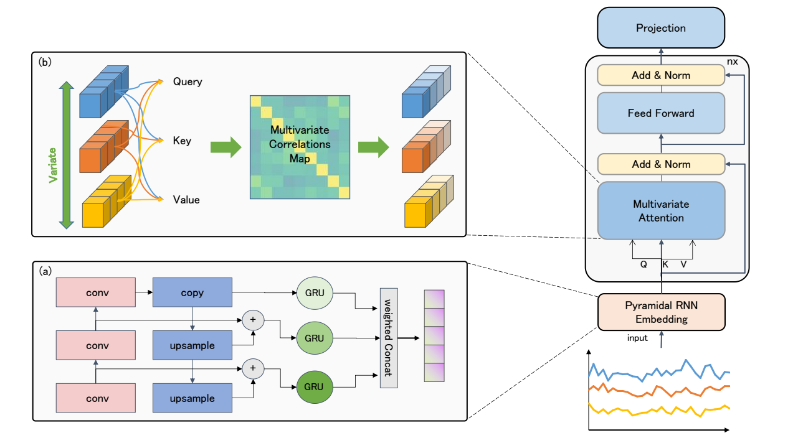
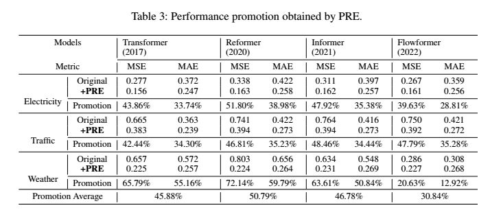
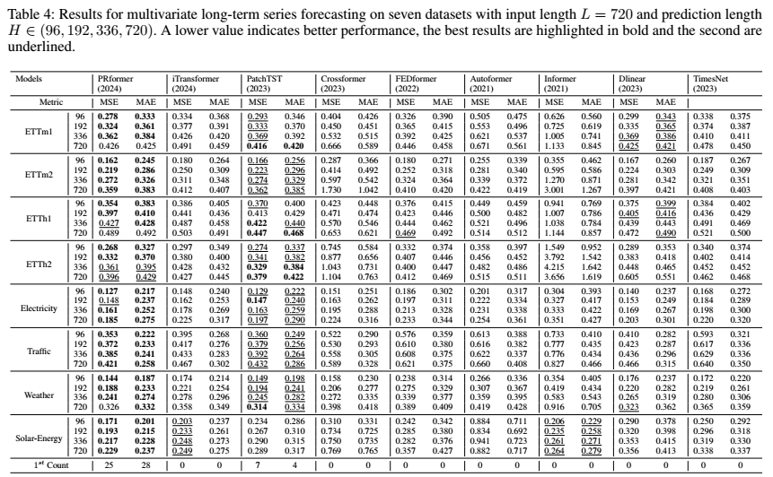
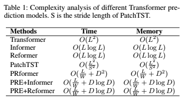

# PRformer: Pyramidal Recurrent Transformer for Multivariate Time Series Forecasting

The paper is about to be published on arXiv.

## Introduction

The paper proposes Pyramid RNN embeddings (PRE) module, which consists of feature pyramids and multi-scale RNNs to learn embeddings of univariate time series. PRE can replace positional encoding and significantly improve the performance of existing Transformer-based time series predictors.

It achieves state-of-the-art performance on 8 real-world time series datasets, significantly outperforming linear model predictors.

Thanks to PRE, the time and space complexity of PRformer grows linearly with sequence length.

Compared to the existing Transformer SOTA baseline PatchTST, PRformer significantly reduces running time and memory usage.

## Abstract

The self-attention mechanism in Transformer architecture, invariant to sequence order, necessitates positional embeddings to encode temporal order in time series prediction. We argue that this reliance on positional embeddings restricts the Transformer's ability to effectively represent temporal sequences, particularly when employing longer lookback windows. To address this, we introduce an innovative approach that combines Pyramid RNN embeddings(PRE) for univariate time series with the Transformer's capability to model multivariate dependencies. PRE, utilizing pyramidal one-dimensional convolutional layers, constructs multiscale convolutional features that preserve temporal order. Additionally, RNNs, layered atop these features, learn multiscale time series representations sensitive to sequence order. This integration into Transformer models with attention mechanisms results in significant performance enhancements. We present the PRformer, a model integrating PRE with a standard Transformer encoder, demonstrating state-of-the-art performance on various real-world datasets. This performance highlights the effectiveness of our approach in leveraging longer lookback windows and underscores the critical role of robust temporal representations in maximizing Transformer's potential for prediction tasks.